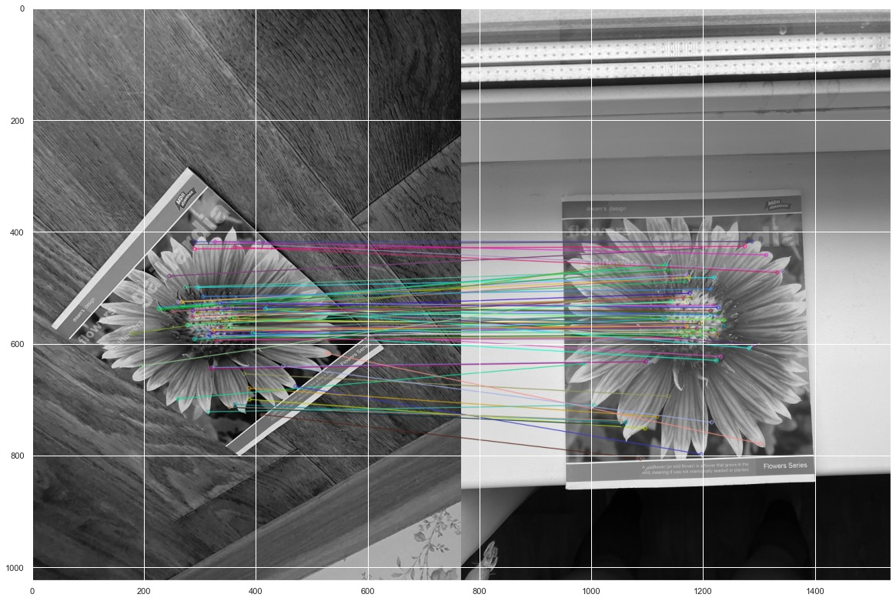

## Lab2

### Brisk and Akaze

### Results

### Akaze

### Brisk

### Conclusions
1. AKAZE works better than BRISK when we have bad quality images or blurry images. In general, the accuracy of recognition is higher. AKAZE wors better for images of notebook.
1. BRISK is quite faster, that's why in good conditions it is more efficient.
1. BRISK is good for textures, volumetric images. It worked better than AKAZE on vehicle images.
1. Both descriptors performed well when there is turning or overlapping. 
1. Both descriptors performed better with images of a flat object.

