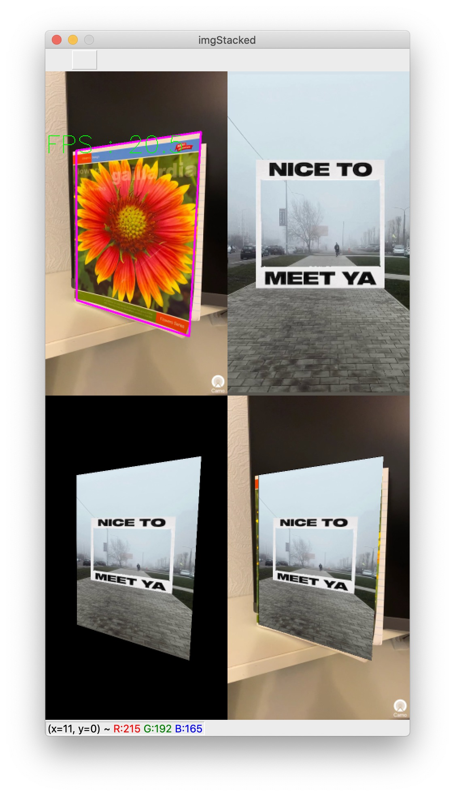

# Lab4

## Result 

### Akaze ~ 20 fps
The trained model of the classifier was taken from Lab 3, adding a couple of lines of code and saving in the file, because it is much more convenient and we use the same object (notebook): pickle.dump(xgb_model_akaze, open("pima.pickle.dat", "wb"))

### Brisk ~ 30 fps

### Orb(1000) without clasificator ~ 60 fps

